# 面向锂离子电池充电控制的多均衡智能体强化学习

**英文题目：** Multi-Balancing-Agent Reinforcement Learning for Charging Control of Lithium-ion Batteries

**作者：** Xuanyi Li、Zihao Zheng、Tao Kuang、Bing-Chuan Wang、Biao Luo、Zhongmei Li。

Xuanyi Li 与 Zihao Zheng 为共同第一作者。Bing-Chuan Wang、Biao Luo 为 IEEE 高级会员，Zhongmei Li 为 IEEE 会员。

Xuanyi Li、Zihao Zheng、Tao Kuang、Bing-Chuan Wang 和 Biao Luo 就职于中国长沙中南大学自动化学院，邮政编码 410083。电子邮箱依次为：8207240609@csu.edu.cn、8207242010@csu.edu.cn、8207241908@csu.edu.cn、bingcwang@csu.edu.cn、biao.luo@csu.edu.cn。

Zhongmei Li 就职于中国上海华东理工大学能源化工过程智能制造教育部重点实验室，邮政编码 200237；电子邮箱：zhongmeili@ecust.edu.cn。

ORCID：Xuanyi Li，0009-0009-9775-1612；Tao Kuang，0009-0000-5283-032X；Bing-Chuan Wang，0000-0002-0234-2843。

## 摘要

锂离子电池具有能量密度高、循环寿命长和自放电率低等优点，广泛应用于电动汽车和储能系统。然而，电池包内的电芯差异可能降低可用容量、充电效率和安全性。因此，在保持荷电状态（SOC）均衡的同时实现快速充电，对电池包运行具有重要意义。

本文提出一种多均衡智能体强化学习（MBA-RL）框架，在不使用专用均衡拓扑的条件下实现协调充电控制。每个智能体调节一个电芯的充电电流，共享目标协调电池包的充电进程与 SOC 均衡。基于模型的安全机制在执行前，根据电压、温度和 SOC 限制检查请求电流。框架将充电电流限制为非负值，从而避免对高 SOC 电芯进行放电。

在覆盖 12 组未用于训练的初始 SOC 条件、基于 5 次独立训练的共 60 次仿真评估中，MBA-RL 相比参数共享的独立 Q 学习和集中式深度 Q 网络（DQN）控制，累积 SOC 不均衡量分别降低 12.65% 和 10.82%。安全机制在全部 52 次安全测试的采样时刻均满足约束。将同一机制纳入训练后，全部 52 次测试也均达到充电目标。

**关键词：** 充电控制；SOC 均衡；锂离子电池；多智能体强化学习。

## I. 引言

锂离子电池因能量密度高、循环寿命长和自放电率低，广泛应用于电动汽车（EV）和储能系统 [1, 2]。在实际应用中，单个电芯无法满足大型电池系统对电压和容量的要求 [3, 4]，因此，电池包通常由多个电芯串并联组成。制造和运行条件的差异会导致电芯状态及老化特性不同，进而降低电池包的可用容量、充电效率和耐久性，并可能增加安全风险 [5, 6]。因此，有效的充电控制需要在实现快速充电的同时，保持电芯间的荷电状态（SOC）均衡，并满足运行和安全约束。

现有均衡策略大多将均衡拓扑与均衡算法结合使用。均衡拓扑提供能量转移或耗散的物理路径，均衡算法则决定如何控制该拓扑，以减小电芯间的差异 [7, 8]。两者的协同设计影响均衡性能、能量效率、系统复杂度和实现成本 [9]。

**均衡拓扑。** 均衡拓扑通常分为主动均衡和被动均衡两类。主动均衡通过开关电容、电感 [10]、变压器 [11] 或 DC-DC 变换器 [12]，将能量较高电芯的多余能量转移至能量较低的电芯。这种方式提高了能量利用率，但随着电芯数量和串并联连接数量增加，所需电路也越来越复杂。被动均衡则采用与各电芯并联的放电电阻 [13]，将多余能量以热量的形式耗散。这种方式简化了电路，但降低了能量效率。因此，传统主动均衡和被动均衡均需要额外的硬件路径，并分别带来电路复杂度增加或直接能量损耗的问题。

**均衡算法。** 传统均衡算法通常基于恒流恒压（CC-CV）充电。Aizpuru 等 [14] 将 CC-CV 充电与单电芯实验数据结合，构建了被动均衡系统。Hoque 等 [15] 采用粒子群优化（PSO）优化 CC-CV 均衡控制器。这些方法较易实现，但应对电芯状态和运行条件变化的能力有限，且通常需要采用保守约束来维持安全运行。

更先进的控制方法也已应用于电池均衡研究。文献 [16] 采用模糊逻辑控制自适应调节均衡过程。Fan 等 [17] 提出了一种基于模型预测控制的快速主动均衡方法。这些方法提高了控制灵活性和均衡性能，但其性能仍依赖预先设定的控制规则或模型，可能限制其适应充电过程中电池状态变化的能力。

深度强化学习（DRL）为根据观测到的电池状态调整充电决策提供了另一种方法。Yang 等 [18] 提出了一种基于 DRL、兼顾均衡的快速充电框架，文献 [19] 则将 DRL 应用于冗余电池系统的主动均衡。通过与电池环境交互学习，这些方法能够随电池状态的变化调整充电决策。然而，仍存在两方面局限。首先，已有 DRL 方法仍依赖均衡拓扑在电芯间重新分配能量，因此保留了传统均衡系统所需的额外硬件和能量转移路径。其次，在充电过程中的某一时刻达到 SOC 均衡，并不能保证电芯此后始终保持均衡。随着充电继续进行，电芯状态的变化可能使 SOC 差异再次增大。

对于多个决策主体依据局部信息采取行动、同时具有共同目标的问题，多智能体强化学习（MARL）提供了适用的框架 [20, 21]。Liang 等 [22] 采用 MARL 对电池换电与充电系统进行实时管理，Dong 等 [23] 则将 MARL 应用于削峰控制。本文研究的电池充电问题具有类似的协作结构。每个电芯具有自身的电压、温度和 SOC，并可分配独立调节的充电电流；同时，所有电芯共同追求快速充电和 SOC 均衡。这使得通过 MARL 直接协调充电电流、而无需依赖独立均衡拓扑成为可能。

基于上述建模思路，本文提出用于锂离子电池充电控制的多均衡智能体强化学习（MBA-RL）框架。每个智能体调节一个电芯的充电电流，并通过共同的电池包目标实现智能体间的协调。同时，引入基于模型的安全机制，在执行前评估请求充电电流。采用根据具有不同循环经历的电芯分别辨识得到的电化学-热模型，对该框架进行评估。

本文的主要贡献如下：

1. 提出 MBA-RL 框架，在不使用专用均衡拓扑的条件下，协调各电芯独立调节的充电电流。该协作控制策略在电池包层面同时考虑充电进程和 SOC 均衡。
2. 将基于模型的安全机制集成至 MBA-RL 框架。在执行前，根据预测的电压、温度和 SOC 约束检查请求充电电流，使充电策略在规定的电芯限值内运行。
3. 采用根据具有不同循环经历的电芯分别辨识得到的电化学-热模型评估所提框架。评估涵盖未用于训练的初始 SOC 条件、运行条件变化、组件消融及不同电池包规模。

本文其余部分安排如下：第 II 节建立充电控制问题的模型；第 III 节介绍 MBA-RL 框架及安全机制；第 IV 节报告并讨论实验结果；第 V 节给出结论。

## II. 问题建模

本节首先介绍用于描述电芯动态的电化学–热模型，随后将充电控制问题表述为约束优化问题。

### A. 电化学–热模型

#### 1. 电化学模型

采用 PyBaMM 中实现的含电解液动态的单粒子模型（SPMe）描述电芯动态 [24, 25]。SPMe 用一个代表性颗粒描述每个电极，同时考虑电解液动态。正、负极之间的平衡电势差表示为

$$
V_{\mathrm{eq}}(t)
=U^{ref}_{p}
\left(
\frac{c_{s,\mathrm{surf},p}(r,t)}{c_{s,\mathrm{max},p}}
\right)
-U^{ref}_{n}
\left(
\frac{c_{s,\mathrm{surf},n}(r,t)}{c_{s,\mathrm{max},n}}
\right).
\tag{1}
$$

其中，$t$ 和 $r$ 分别表示时间和径向坐标；$U^{ref}_{p}$ 和 $U^{ref}_{n}$ 分别为正、负极的平衡电势函数；$c_{s,\mathrm{surf},p}$ 和 $c_{s,\mathrm{surf},n}$ 为相应的表面锂浓度；$c_{s,\mathrm{max},p}$ 和 $c_{s,\mathrm{max},n}$ 为固相中的最大锂浓度。

SOC 根据负极中锂浓度的体积平均值计算：

$$
SOC(t)
=\frac{\bar{c}_{s,n}(t)-C_{n,\min}}
{C_{n,\max}-C_{n,\min}}.
\tag{2}
$$

其中，$\bar{c}_{s,n}(t)$ 为负极颗粒中锂浓度的体积平均值，$C_{n,\min}$ 和 $C_{n,\max}$ 分别为 SOC 为 0% 和 100% 时对应的锂浓度。控制所用的端电压直接由 SPMe 输出获得。

#### 2. 热模型

采用 PyBaMM 中的集总热模型描述电芯温度，以空间平均状态表示温度。相应的热平衡方程为

$$
m c_p\frac{\mathrm{d}T}{\mathrm{d}t}
=\dot{Q}_{\mathrm{gen}}
-hA_s\left(T-T_{\mathrm{amb}}\right).
\tag{3}
$$

其中，$m$ 和 $c_p$ 分别为电芯质量和比热容；$\dot{Q}_{\mathrm{gen}}$ 为电化学模型给出的产热速率；$hA_s(T-T_{\mathrm{amb}})$ 表示电芯向环境传递的热量速率；$T_{\mathrm{amb}}$ 为环境温度。

### B. 充电控制问题

控制目标是在满足运行约束的条件下，最小化达到目标 SOC 并满足均衡条件所需的充电时间。时刻 $t$ 的 SOC 标准差定义为

$$
\sigma(t)
=\sqrt{
\frac{1}{n}
\sum_{i=1}^{n}
\left(SOC_i(t)-\overline{SOC}(t)\right)^2
}.
\tag{4}
$$

其中，$\overline{SOC}(t)=n^{-1}\sum_{i=1}^{n}SOC_i(t)$ 为 $n$ 个电芯的平均 SOC。优化问题表示为

$$
\min_{\mathbf{I}(t)}\quad t_b-t_0,
\tag{5}
$$

满足终端均衡条件

$$
\sigma(t_b)\leq\beta,
\tag{6}
$$

以及终端 SOC 条件

$$
SOC_i(t_b)\geq SOC_{\mathrm{ref}},
\quad i=1,2,\ldots,n.
\tag{7}
$$

其中，

$$
\mathbf{I}(t)
=\left[I_1(t),\ldots,I_n(t)\right]^{\mathrm{T}}
\in\mathbb{R}^{n}
$$

为 $n$ 个电芯的充电电流向量。$t_0$ 表示充电开始时刻，$t_b$ 表示首次同时满足上述两个终端条件的时刻。参数 $\beta$ 和 $SOC_{\mathrm{ref}}$ 分别为均衡阈值和终端 SOC 下限。在评估中，随后进行 270 s 的零电流保持，以验证目标 SOC、均衡和安全条件仍然满足，之后才将任务判定为成功。该验证阶段不计入充电时间 $t_b-t_0$。仅满足 $\sigma(t)\leq\beta$ 并不意味着所有电芯均已达到 $SOC_{\mathrm{ref}}$。

充电过程中，各电芯还须满足以下运行约束：

$$
\begin{array}{rl}
&I_{\min}\leq I_i(t)\leq I_{\max}\\[4pt]
&T_i(t)\leq T_{\max},\quad V_i(t)\leq V_{\max}\\[4pt]
&SOC_i(t)\leq SOC_{\max}.
\end{array}
\tag{8}
$$

其中，$I_{\min}=0$ 和 $I_{\max}=7.5$ A 规定允许的充电电流范围；$T_{\max}$、$V_{\max}$ 和 $SOC_{\max}=0.95$ 分别为电芯温度、电压和 SOC 的上限。

因此，充电控制需要协调各电芯的电流，使电池包在保持 SOC 均衡并满足式 (8) 所示运行约束的条件下，尽快达到目标 SOC。

## III. 用于充电控制的 MBA-RL 方法

每个电芯对应一个智能体，智能体观测该电芯的电压、温度和 SOC，并调节其充电电流。所有智能体共享电池包快速充电与 SOC 均衡的目标。由于各智能体在执行时依据局部观测作出决策，而各电芯的充电电流又需要围绕共同目标进行协调，本文采用 QMIX [26] 实现集中训练与分散执行。由此构建的 MBA-RL 框架将 QMIX 控制器与第 II 节介绍的电芯模型相结合。

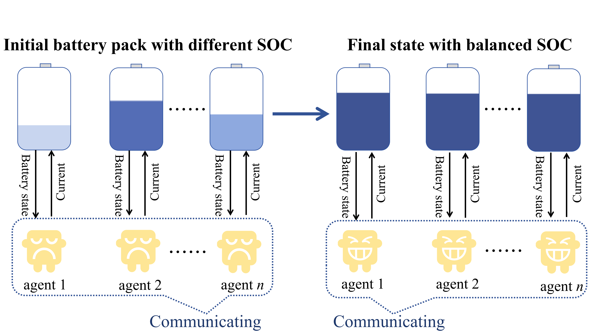

图 1：电池充电控制问题的 MARL 建模。每个智能体调节一个电芯的充电电流，并共享快速充电与 SOC 均衡的目标。

### A. MBA-RL 框架

MBA-RL 的结构如图 2 所示。所有智能体共享一个循环 Q 网络。对于智能体 $i$，网络以当前观测 $o_t^i$、上一时刻的执行动作 $\tilde{a}_{t-1}^i$ 和智能体标识作为输入，估计局部动作价值 $Q_i$。集中训练时，混合网络将各局部动作价值组合为联合动作价值 $Q_{\mathrm{tot}}$，其权重由超网络根据全局状态生成。分散执行时的动作选择不需要混合网络。训练时，目标智能体网络和目标混合网络用于构造时序差分目标。

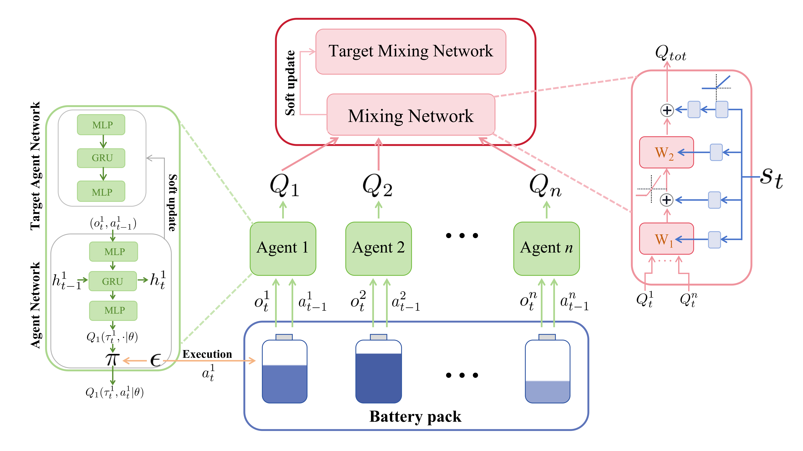

图 2：MBA-RL 框架结构。共享智能体网络由两个多层感知机（MLP）和一个门控循环单元（GRU）组成。

充电控制问题建模为分散式部分可观测马尔可夫决策过程（Dec-POMDP）[27]：

$$
G=\left\langle
\mathcal{N},
\mathcal{S},
\{\mathcal{A}_i\}_{i=1}^{n},
\mathcal{P},
\mathcal{R},
\{\mathcal{O}_i\}_{i=1}^{n},
\mathcal{O},
\gamma
\right\rangle.
$$

其中，$\mathcal{N}=\{1,\ldots,n\}$ 为智能体集合；$\mathcal{S}$ 为全局状态空间；$\mathcal{A}_i$ 和 $\mathcal{O}_i$ 分别为智能体 $i$ 的动作空间和观测空间；$\mathcal{P}$ 为状态转移核；$\mathcal{R}$ 为共享奖励函数；$\mathcal{O}$ 为观测函数；$\gamma$ 为折扣因子。

#### 1. 状态空间与观测空间

时间步 $t$ 的全局状态由所有电芯的观测构成：

$$
\mathbf{s}_t
=\left[o_t^1,o_t^2,\ldots,o_t^n\right]^{\mathrm{T}}.
\tag{9}
$$

对于智能体 $i$，局部观测为 $o_t^i=[V_i(t),T_i(t),SOC_i(t)]$，其中 $V_i(t)$、$T_i(t)$ 和 $SOC_i(t)$ 分别为电芯 $i$ 的电压、温度和 SOC。因此，各智能体依据对应电芯的局部信息作出充电决策，而完整状态在集中训练阶段可用。

#### 2. 动作空间

各智能体从 $\mathcal{A}_{\mathrm{cand}}=\{0,0.5,\ldots,7.5\}\,\mathrm{A}$ 中选择请求充电电流。选择动作之前，可用动作掩码排除与电芯当前状态冲突的动作。当 $SOC_i\geq0.95$ 时，仅允许零电流；当 $V_i\geq V_{\max}$ 或 $T_i\geq T_{\max}$ 时，排除大于 1 A 的电流。

请求联合动作及其对应的可用动作空间为

$$
\mathbf{a}_t
=\left[a_t^1,a_t^2,\ldots,a_t^n\right]^{\mathrm{T}},
\qquad
\mathcal{A}(\mathbf{s}_t)
=\prod_{i=1}^{n}\mathcal{A}_i(\mathbf{s}_t).
\tag{10}
$$

其中，$\mathcal{A}_i(\mathbf{s}_t)\subseteq\mathcal{A}_{\mathrm{cand}}$，$\mathbf{m}_t$ 表示相应的可用动作掩码。掩码仅依据当前状态，不能判断请求电流在下一个决策周期内是否始终可行。因此，请求电流在执行前还需经过基于模型的安全机制检查。

#### 3. 奖励函数

各智能体共享的奖励由时间惩罚、SOC 均衡惩罚以及电压和温度越限惩罚组成：

$$
r_t=r_{\mathrm{time}}+r_{\mathrm{bal}}+r_{\mathrm{safety}}.
\tag{11}
$$

达到终止条件之前，时间惩罚为 $r_{\mathrm{time}}=-\lambda_{\mathrm{time}}$。均衡项为

$$
r_{\mathrm{bal}}
=\begin{cases}
-\lambda_{\mathrm{bal}}(\sigma(t)-\beta),
&\sigma(t)\geq\beta,\\
0,&\text{其他情况}.
\end{cases}
\tag{12}
$$

其中，$\sigma(t)$ 由式 (4) 定义，$\beta$ 为均衡阈值。

安全项为 $r_{\mathrm{safety}}=r_{\mathrm{volt}}+r_{\mathrm{temp}}$，其中 $r_{\mathrm{volt}}=\sum_{i=1}^{n}\delta_{v,i}$，$r_{\mathrm{temp}}=\sum_{i=1}^{n}\delta_{t,i}$。各电芯的惩罚项定义为

$$
\begin{aligned}
\delta_{v,i}
&=\begin{cases}
-\lambda_v\left(V_i(t)-V_{\max}\right),
&V_i(t)\geq V_{\max},\\
0,&\text{其他情况},
\end{cases}\\[4pt]
\delta_{t,i}
&=\begin{cases}
-\lambda_T\left(T_i(t)-T_{\max}\right),
&T_i(t)\geq T_{\max},\\
0,&\text{其他情况}.
\end{cases}
\end{aligned}
\tag{13}
$$

#### 4. 状态转移与终止

策略选择请求电流，安全机制确定执行电流。两者的联合形式分别表示为 $\mathbf{a}_t$ 和 $\tilde{\mathbf{a}}_t$。

执行电流与电池动态共同决定下一状态。终止标志 $d_t$ 记录当前回合是否结束。在评估中，同时达到目标 SOC 和均衡条件后，充电阶段结束；任务成功还要求随后的保持阶段满足目标 SOC、均衡和安全条件。回合也可能在未完成任务时结束，例如安全机制无法找到可行电流时。训练过程中同时保留请求动作和执行动作，以明确记录安全机制对动作的调整。

### B. 协同价值学习

MBA-RL 通过集中训练协调不同电芯的充电决策。智能体 $i$ 根据动作–观测历史 $\tau_t^i$ 估计局部动作价值 $Q_i(\tau_t^i,a_t^i|\theta)$。数据采集时，各智能体采用 $\epsilon$-贪心策略选择请求动作：

$$
a_t^i
=\begin{cases}
\text{随机选择一个可用动作},&\text{概率为 }\epsilon,\\
\displaystyle\arg\max_{a\in\mathcal{A}_i(\mathbf{s}_t)}
Q_i(\tau_t^i,a|\theta),&\text{概率为 }1-\epsilon.
\end{cases}
\tag{14}
$$

所有智能体共享网络参数 $\theta$。网络输入中包含独热编码的智能体标识，使共享网络能够区分不同电芯。

集中训练时，混合网络将局部动作价值组合为联合动作价值：

$$
\begin{aligned}
&Q_{\mathrm{tot}}(\boldsymbol{\tau}_t,\mathbf{s}_t,\mathbf{a}_t|\theta,\phi)\\
&\qquad=f_{\phi}(\mathbf{Q}_t,\mathbf{s}_t).
\end{aligned}
\tag{15}
$$

其中，$\boldsymbol{\tau}_t$ 表示联合动作–观测历史，$\mathbf{Q}_t$ 为各局部价值 $Q_i(\tau_t^i,a_t^i|\theta)$ 构成的向量。$\theta$ 为共享智能体网络的参数，$\phi$ 包含混合网络及其依赖全局状态的超网络参数。

QMIX 施加如下单调性约束：

$$
\frac{\partial Q_{\mathrm{tot}}}{\partial Q_i}\geq0,
\qquad i=1,2,\ldots,n.
\tag{16}
$$

该约束使分散式贪心动作选择与联合动作价值的最大化保持一致，因此各智能体能够在执行时独立选择动作。

每经过 $N_t$ 个训练回合，将在线网络参数复制到目标网络，即 $\theta'\leftarrow\theta$、$\phi'\leftarrow\phi$。考虑终止标志和下一状态的可用动作，目标值为

$$
\begin{aligned}
y_t^{\mathrm{tot}}
&=r_t+\gamma(1-d_t)\\
&\quad\times\max_{\mathbf{a}\in\mathcal{A}(\mathbf{s}_{t+1})}
Q_{\mathrm{tot}}(\boldsymbol{\tau}_{t+1},\mathbf{s}_{t+1},\mathbf{a}|\theta',\phi').
\end{aligned}
\tag{17}
$$

共享奖励通过 $Q_{\mathrm{tot}}$ 将各电芯的局部充电决策联系起来。时间惩罚促使策略缩短充电时间，均衡项则惩罚电芯间的 SOC 差异。由此，各智能体在训练中学习协调充电电流，共同实现快速充电与 SOC 均衡。

### C. 基于模型的安全机制

每个决策步中，MBA-RL 首先为各电芯生成请求电流。安全机制从请求电流开始，依次评估该电流及更低的候选电流。评估采用标称 SPMe，预测范围包括下一个决策周期及随后一个零电流周期。

根据模型预测与电芯观测响应之间的偏差，对预测的 SOC、电压和温度峰值进行修正。电压和温度上限减去表 II 中的安全裕度，预测 SOC 则与 $SOC_{\max}$ 比较。从修正后的预测满足上述界限的候选电流中，选择最大值作为执行电流。

若任一电芯找不到可行电流，则终止该回合，不推进电池模型，也不执行请求动作。训练和测试采用相同的安全机制。

### D. 训练流程

状态转移首先收集到临时回合缓冲区 $\mathcal{E}$ 中，采集结束后，再以一个回合的形式加入回放缓冲区 $\mathcal{D}$。每条转移记录包含状态、可用动作掩码、请求动作、执行动作、奖励、下一状态、下一时刻的可用动作掩码以及终止标志。训练时，从 $\mathcal{D}$ 中按批次抽取回合，$|\mathcal{D}|$ 表示已存储的回合数。

Q 函数根据策略选择的请求动作进行计算，而执行动作被纳入后续的动作–观测历史。由此，智能体网络可以考虑安全机制对动作作出的调整。

完整训练流程见算法 1。

**算法 1：MBA-RL 训练流程**

1. 初始化智能体网络参数 $\theta$、混合网络参数 $\phi$ 和回放缓冲区 $\mathcal{D}$。
2. 设置 $\theta'\leftarrow\theta$ 和 $\phi'\leftarrow\phi$。
3. 对 $episode=1,\ldots,N_{\mathrm{episode}}$，依次执行以下步骤：

   1. 初始化所有智能体的 $\tau_0^i$，并观测 $\mathbf{s}_0$。
   2. 初始化空的回合缓冲区 $\mathcal{E}$。
   3. 设置 $t\leftarrow0$、$done\leftarrow\mathrm{False}$。
   4. 当 $\neg done$ 时，循环执行：

      1. 计算可用动作掩码 $\mathbf{m}_t$。
      2. 根据探索率调度更新 $\epsilon$。
      3. 对每个智能体 $i$，使用 $o_t^i$ 和 $\tilde{a}_{t-1}^i$ 更新 $\tau_t^i$，并按式 (14) 选择请求动作 $a_t^i$。
      4. 使用安全机制评估候选电流。
      5. 若至少一个电芯没有可行电流，将环境返回的终止转移记录（$d_t=1$）存入 $\mathcal{E}$，随后结束该回合，不推进电池模型，并退出当前循环。
      6. 将 $\tilde{\mathbf{a}}_t$ 设为可行的执行电流向量。
      7. 执行 $\tilde{\mathbf{a}}_t$，观测 $r_t$、$\mathbf{s}_{t+1}$ 和 $done$。
      8. 计算下一时刻的可用动作掩码 $\mathbf{m}_{t+1}$。
      9. 将转移记录 $\left\langle \mathbf{s}_t,\mathbf{m}_t,\mathbf{a}_t, \tilde{\mathbf{a}}_t,r_t, \mathbf{s}_{t+1},\mathbf{m}_{t+1},done \right\rangle$ 存入 $\mathcal{E}$。

      10. 令 $t\leftarrow t+1$。

   5. 若 $\mathcal{E}\neq\varnothing$，将收集的回合 $\mathcal{E}$ 加入 $\mathcal{D}$。
   6. 若 $|\mathcal{D}|\geq N_{\mathrm{batch}}$，执行以下训练步骤：

      1. 从 $\mathcal{D}$ 中抽取包含 $N_{\mathrm{batch}}$ 个回合的一批数据。
      2. 根据式 (15) 计算 $Q_{\mathrm{tot}}$。
      3. 根据式 (17) 计算 $y_t^{\mathrm{tot}}$。
      4. 使用 RMSprop [28] 更新 $\theta$ 和 $\phi$，使 $\left(y_t^{\mathrm{tot}}-Q_{\mathrm{tot}}\right)^2$ 最小。

   7. 若 $episode\bmod N_t=0$，设置 $\theta'\leftarrow\theta$、$\phi'\leftarrow\phi$。

## IV. 结果与讨论

采用根据三个三星 40T 21700 电芯辨识得到的 SPMe 模型评估 MBA-RL，每个电芯的标称容量为 4000 mAh。电压和温度数据通过图 3 所示的 NEWARE 平台采集。辨识所得模型用于训练和仿真测试，各电芯的充电电流独立调节。

**图 3　电芯电压和温度测量实验平台。**

### A. 电芯模型辨识

电芯 2 和电芯 3 分别经历 140 次和 260 次充放电循环，以获得具有不同循环经历的电芯。它们与电芯 1 的电压和温度响应如图 4 所示。采用粒子群优化（PSO）分别辨识各电芯的 SPMe 参数 [29]。图 5—7 比较了模型预测值与测量值。表 I 中的电压和温度均方根误差（RMSE）量化了这些辨识条件下的拟合误差。

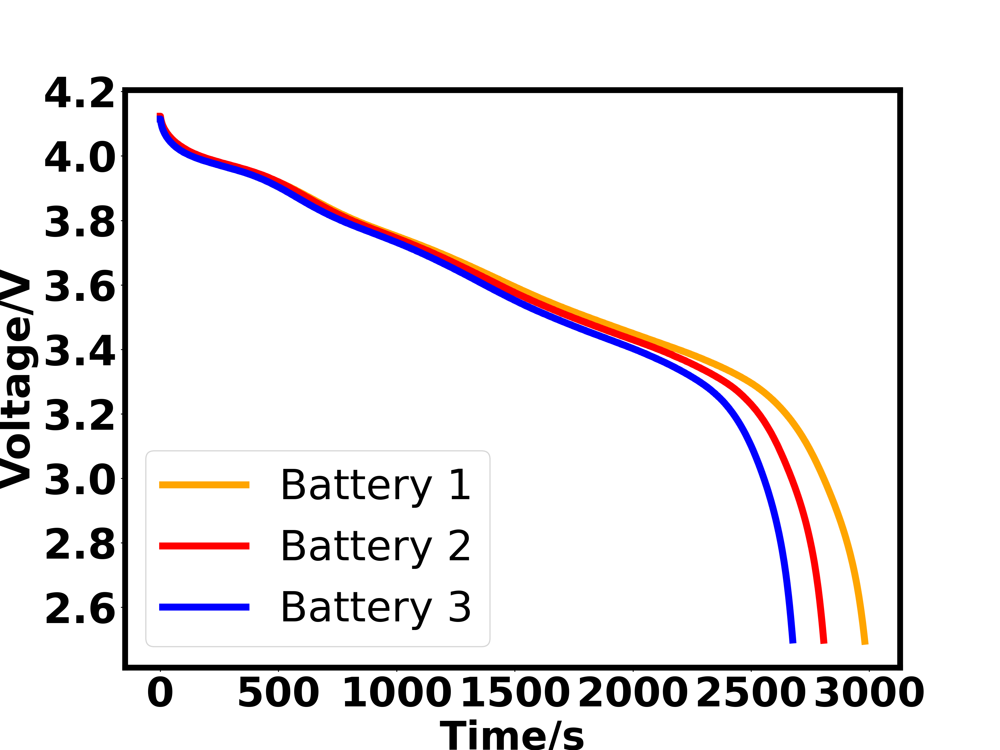

（a）电压。

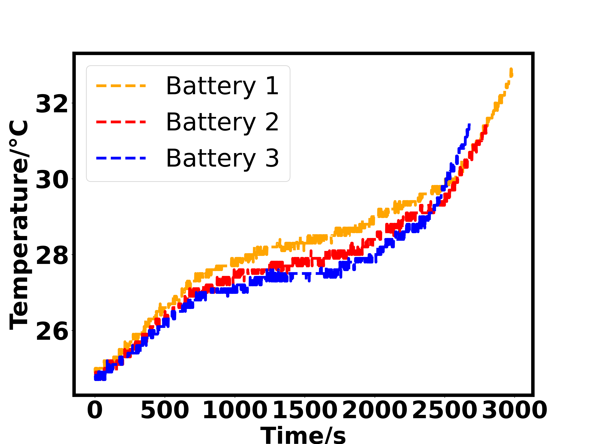

（b）温度。

**图 4　三个电芯的实测响应：（a）电压；（b）温度。**

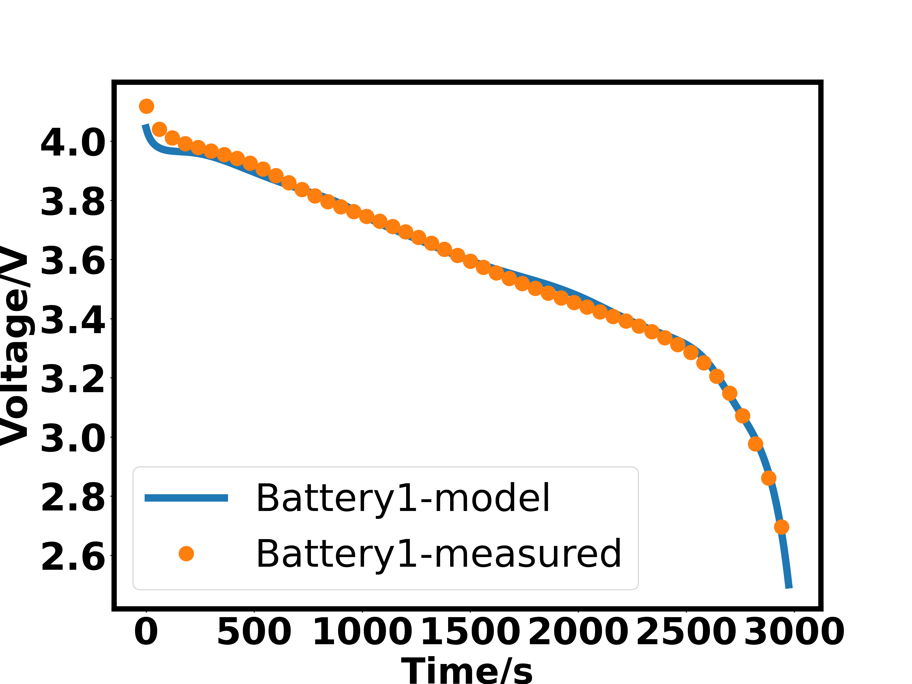

（a）电压。

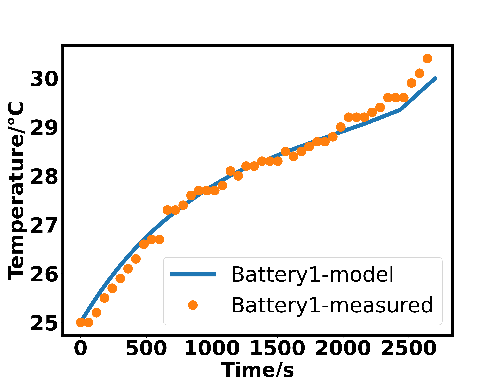

（b）温度。

**图 5　电芯 1 的实测响应与模型响应：（a）电压；（b）温度。**

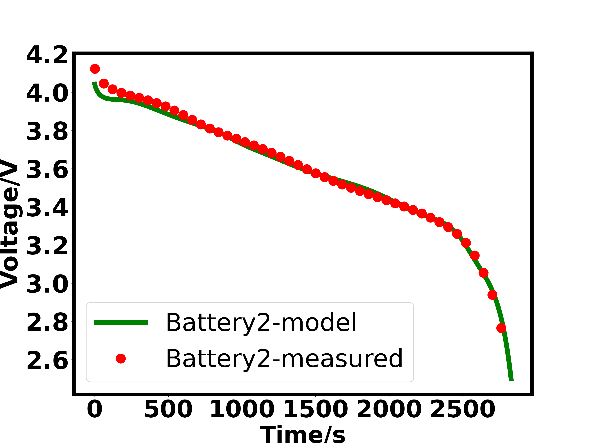

（a）电压。

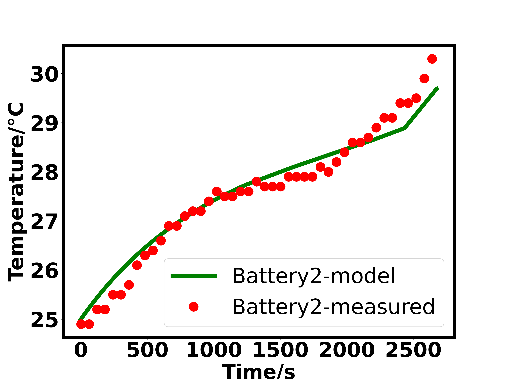

（b）温度。

**图 6　电芯 2 的实测响应与模型响应：（a）电压；（b）温度。**

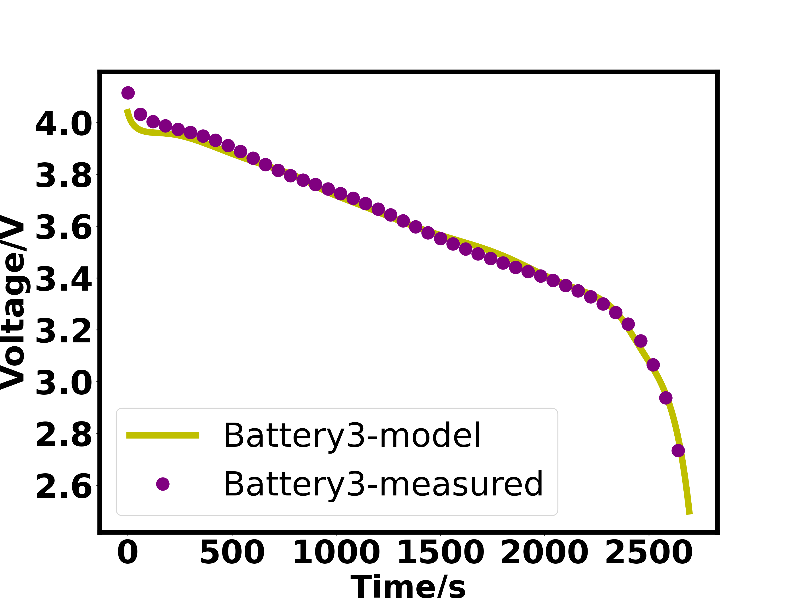

（a）电压。

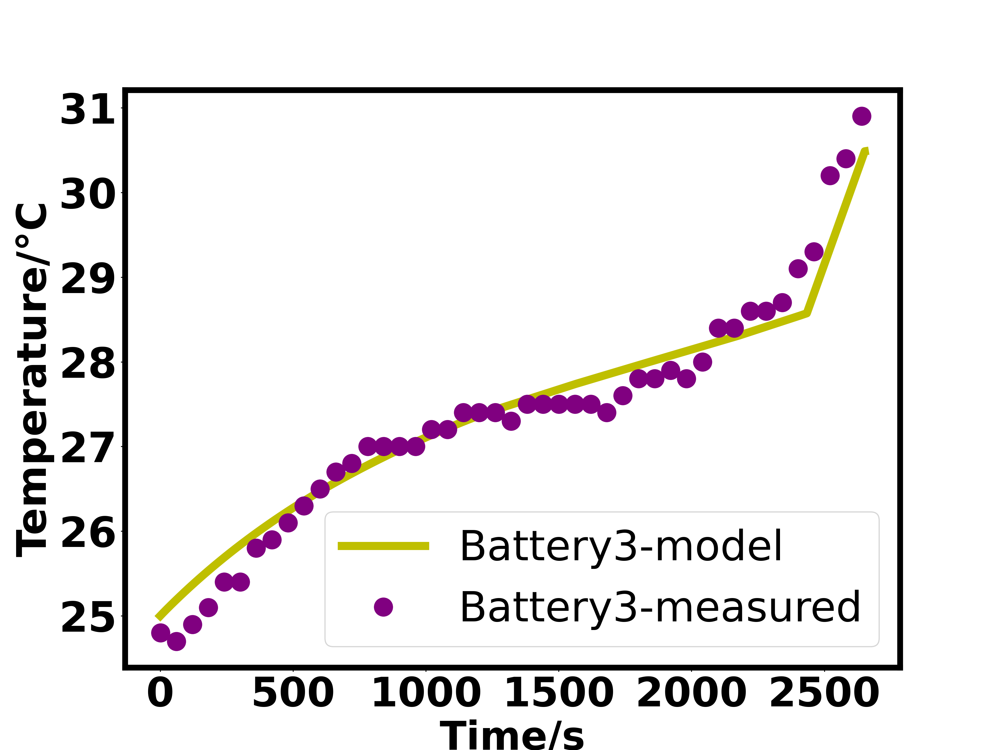

（b）温度。

**图 7　电芯 3 的实测响应与模型响应：（a）电压；（b）温度。**

**表 I　辨识所得电芯模型的电压和温度 RMSE**

| 指标 | 电芯 1 | 电芯 2 | 电芯 3 |
|---|---:|---:|---:|
| 电压 RMSE（V） | 0.026 | 0.035 | 0.029 |
| 温度 RMSE（K） | 0.068 | 0.091 | 0.093 |

### B. 评估方法

电芯模型基于 PyBaMM 实现 [30]。策略通过与这些模型交互进行训练，并在评估时固定网络参数。控制与评估设置汇总于表 II。当所有电芯达到 $SOC_{\mathrm{ref}}=0.90$ 且 $\sigma(t)\leq\beta=0.02$ 时，充电结束。随后以零电流保持 270 s，验证所有电芯的 SOC 仍不低于目标值、SOC 标准差仍满足 $\sigma(t)\leq\beta$，且安全约束保持满足。仅当充电目标和该验证过程均完成，且采样时刻未发生约束违反时，测试才判定为成功。

**表 II　控制与评估设置**

| 设置 | 数值 |
|---|---|
| 电芯模型 | SPMe 与集总热模型 |
| 离散电流集合 | 0–7.5 A，步长为 0.5 A |
| 连续电流范围 | 0–7.5 A |
| 决策间隔 | 90 s |
| 充电目标 | 所有电芯满足 $SOC_i\geq0.90$；$\sigma\leq0.02$ |
| 最大充电时间 | 5400 s |
| 验证时段 | 零电流下保持 270 s |
| 运行限值 | $V\leq4.2$ V，$T\leq309$ K，$SOC\leq0.95$ |
| 电压／温度裕度 | 0.03 V／1 K |
| 环境温度 | 298.15 K（25 °C） |

采用任务完成情况、约束满足情况、计入未成功测试惩罚的时间指标，以及累积 SOC 不均衡量评估性能。对于成功测试，时间指标为充电时间 $t_b-t_0$，不包含验证时段。未成功测试的时间指标取 $5400+270=5670$ s。累积 SOC 不均衡量定义为

$$
J_{\sigma}=\int_{t_0}^{t_{\mathrm{end}}}\sigma(t)\,\mathrm{d}t,
\tag{18}
$$

其中，$t_{\mathrm{end}}$ 为充电阶段最后一个记录时刻。该积分不包含零电流验证时段；即使测试未成功，也仅使用已记录的充电轨迹计算，不延伸至失败测试所赋予的时间指标。SOC 采用 0–1 小数表示，因此 $J_{\sigma}$ 的单位记为 SOC fraction·s。

### C. 充电性能

#### 1. 电芯轨迹示例

图 8 给出了初始条件 A 组 $[0.10,0.20,0.30]^{\mathrm{T}}$ 和 B 组 $[0.30,0.50,0.70]^{\mathrm{T}}$ 下的电芯 SOC 轨迹。MBA-RL 根据各电芯的局部观测选择充电电流，并在集中训练过程中学习协调策略。在这些示例对比中，DQL 控制器还控制电芯间的能量转移拓扑，而 CC-CV 基线在恒压阶段启用该拓扑。

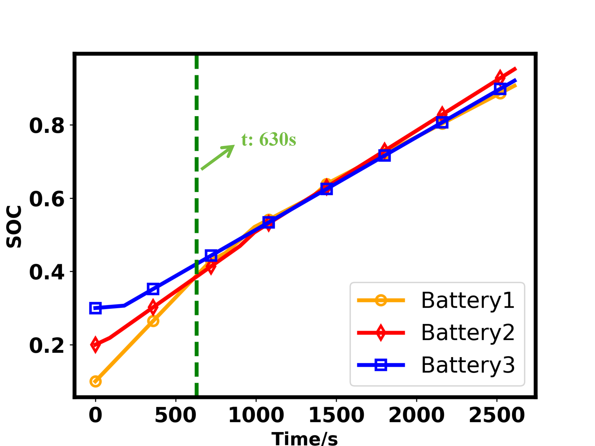

（a）A 组，MBA-RL。

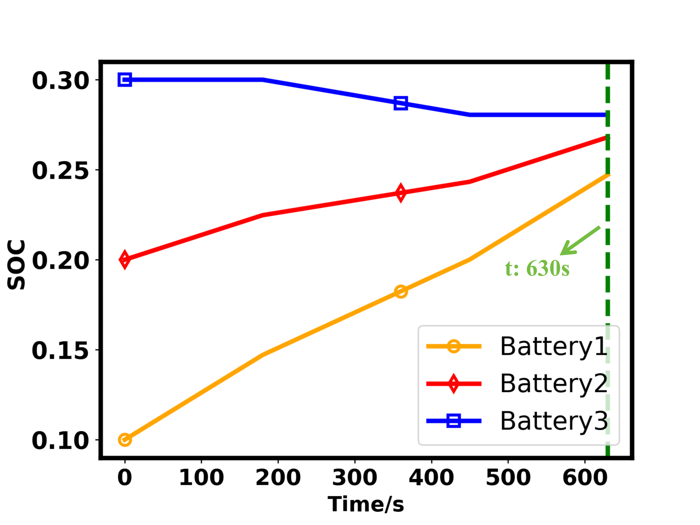

（b）A 组，DQL。

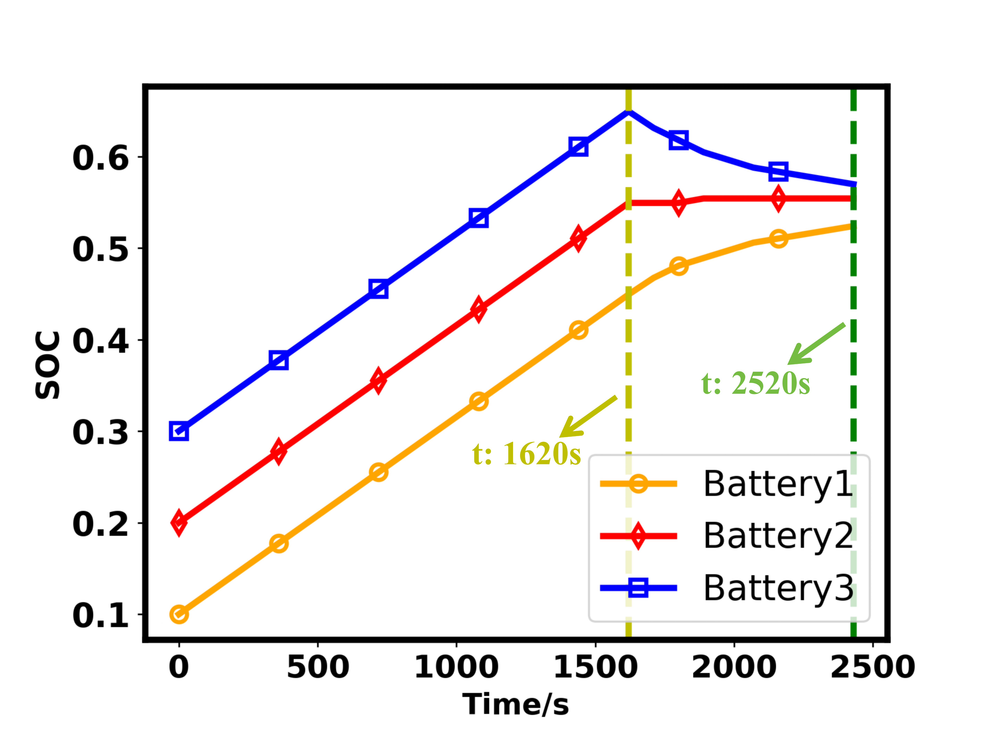

（c）A 组，CC-CV。

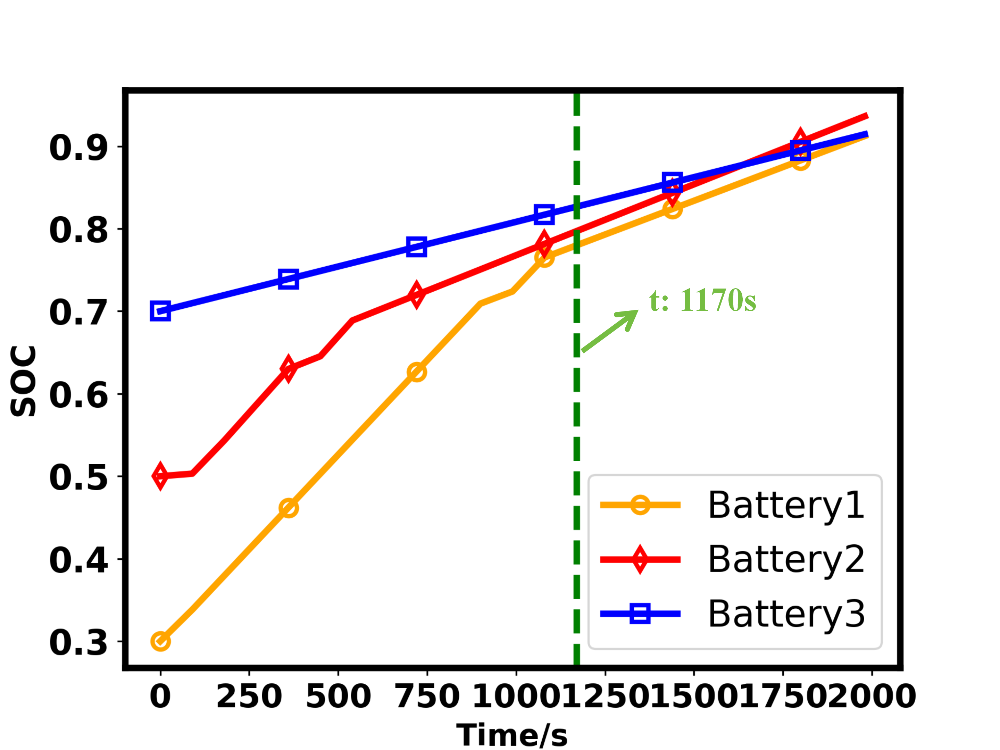

（d）B 组，MBA-RL。

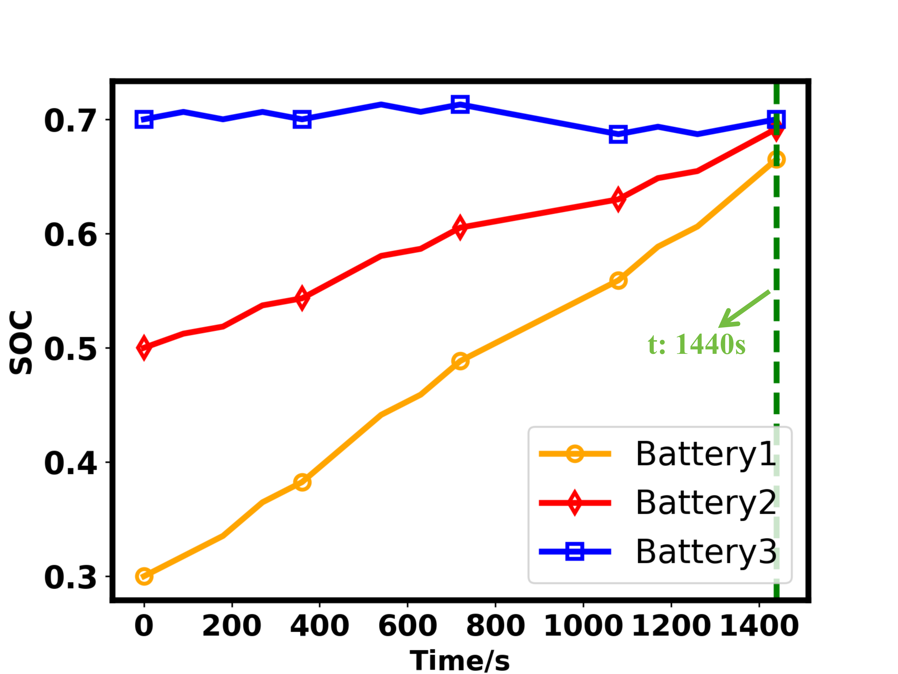

（e）B 组，DQL。

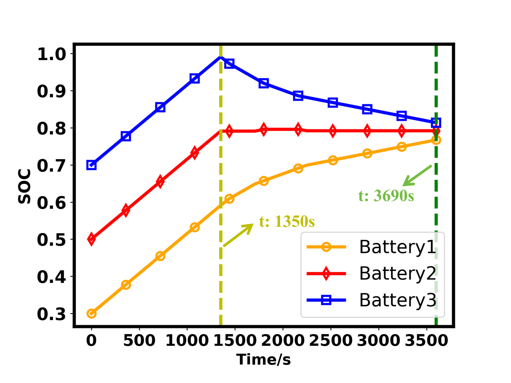

（f）B 组，CC-CV。

**图 8　按 MBA-RL、DQL 和 CC-CV 顺序排列的电芯 SOC 轨迹：（a）—（c）为 A 组；（d）—（f）为 B 组。绿色虚线表示首次满足 $\sigma\leq\beta$ 的时刻，黄色虚线表示恒流充电结束时刻。**

三种方法首次满足均衡阈值时，均尚未达到所有电芯满足目标 SOC 的条件。MBA-RL 轨迹在此后继续延伸，以展示后续充电过程；所示 DQL 和 CC-CV 轨迹则在达到均衡时结束。表 III 列出了这些轨迹终点处的 SOC 向量。不同的终点区分了首次达到均衡与完成充电任务这两个事件；下文采用统一任务判据进行定量比较。

**表 III　示例轨迹终点处的电芯 SOC**

| 方法 | 初始 SOC（%） | 所示轨迹终点 SOC（%） |
|---|---|---|
| MBA-RL | $[10,20,30]^{\mathrm{T}}$ | $[91.66,94.18,92.15]^{\mathrm{T}}$ |
| MBA-RL | $[30,50,70]^{\mathrm{T}}$ | $[91.23,93.62,91.41]^{\mathrm{T}}$ |
| DQL | $[10,20,30]^{\mathrm{T}}$ | $[24.72,26.81,28.05]^{\mathrm{T}}$ |
| DQL | $[30,50,70]^{\mathrm{T}}$ | $[66.50,69.18,70.00]^{\mathrm{T}}$ |
| CC-CV | $[10,20,30]^{\mathrm{T}}$ | $[52.41,55.42,56.97]^{\mathrm{T}}$ |
| CC-CV | $[30,50,70]^{\mathrm{T}}$ | $[76.74,79.21,81.38]^{\mathrm{T}}$ |

#### 2. 未用于训练的初始 SOC 条件下的比较

将 MBA-RL 与参数共享的独立 Q 学习（共享 IQL）、集中式 DQN [31]、离散动作和连续动作 MAPPO [32] 以及 SAC [33] 进行比较。集中式 DQN 基线直接选择各电芯的充电电流，与图 8 中依赖均衡拓扑的 DQL 控制器不同。各方法在训练和评估时均采用相同的运行限值和基于模型的安全筛选。每种方法独立训练 5 次，并在相同的 12 组未用于训练的初始 SOC 条件下评估，共进行 60 次测试。

**表 IV　未用于训练的初始 SOC 条件下的性能比较**

| 方法 | 时间指标（s） | $J_{\sigma}$（SOC fraction·s） |
|---|---:|---:|
| **离散动作方法** | | |
| MBA-RL | $2701.50\pm919.80$ | $205.42\pm57.03$ |
| 共享 IQL | $2641.50\pm439.42$ | $235.17\pm69.76$ |
| 集中式 DQN | $2673.00\pm73.98$ | $230.35\pm24.20$ |
| 离散动作 MAPPO | $2340.00\pm347.96$ | $200.83\pm60.75$ |
| **连续动作方法** | | |
| 连续动作 MAPPO | $2698.50\pm154.65$ | $240.36\pm27.58$ |
| SAC | $2173.50\pm157.09$ | $156.04\pm30.74$ |

注：数值为 5 个独立训练所得策略之间的均值 ± 标准差；每个策略的数值先对 12 个测试条件求平均。

除连续动作 MAPPO 完成 59/60 次测试外，其余方法均完成 60/60 次测试。在相同的离散电流集合下，MBA-RL 相比共享 IQL 和集中式 DQN，分别将累积 SOC 不均衡量降低了 12.65% 和 10.82%，但平均时间指标略高。离散动作 MAPPO 和 SAC 的平均时间指标及累积 SOC 不均衡量均低于 MBA-RL。因此，相对于这两种基于价值的方法，MBA-RL 的改进体现在 SOC 均衡方面，而非缩短充电时间。

图 9 展示了初始 SOC 为 $[0.4203,0.3962,0.5280]^{\mathrm{T}}$、环境温度取表 II 所列数值时的响应。在该条件下，MBA-RL 比共享 IQL 更早达到平均 SOC 为 0.90，且最终 SOC 标准差低于集中式 DQN。任务是否完成则依据各电芯的 SOC 及前述验证时段进行判断。

[MBA-RL、共享 IQL 和集中式 DQN 的充电轨迹图](figures/comparative_charging_discrete.pdf)

**图 9　MBA-RL、共享 IQL 和集中式 DQN 的充电轨迹：（a）平均 SOC；（b）SOC 标准差。（b）中的虚线表示 $\beta=0.02$。图中未显示零电流验证时段。**

### D. 安全机制的作用

在三种设置下评估安全机制：不使用安全机制、仅在固定策略执行时进行安全筛选，以及在训练和执行阶段均进行安全筛选。每种设置采用两个独立训练得到的策略，分别在 26 个条件下测试。表 V 给出了采样时刻的约束满足情况和任务完成情况。

**表 V　安全筛选对约束满足情况和任务完成情况的影响**

| 筛选设置 | 满足约束的测试次数 | 完成任务的测试次数 |
|---|---:|---:|
| 不进行筛选 | 3/52 | 1/52 |
| 仅执行时筛选 | 52/52 | 35/52 |
| 训练和执行时均筛选 | 52/52 | 52/52 |

执行时进行安全筛选，使满足约束的测试次数从 3/52 增加至 52/52，但仍有 17 次测试未能完成充电。在训练时也引入该机制后，任务完成次数增加至 52/52；与仅执行时筛选相比，平均累积 SOC 不均衡量从 469.97 降至 197.34 SOC fraction·s。因此，在训练中纳入安全机制，改善了安全筛选所限定动作范围内的充电性能。

### E. 组件消融

采用与主要对比实验相同的评估方法，考察参数共享、混合网络和均衡奖励的作用。

[组件消融结果图](figures/component_ablation.pdf)

**图 10　组件消融结果。圆点表示每个训练所得策略在 12 个测试条件下的均值，菱形表示各策略之间的均值。虚线标记 MBA-RL 的均值；右侧标签报告 60 次测试中的任务完成次数。**

移除参数共享或均衡奖励后，任务完成次数从 60/60 降至 48/60，平均累积 SOC 不均衡量分别增加 80.47% 和 59.07%。在这两种情况下，5 个训练所得策略中均有 1 个在全部 12 个测试条件下均未完成任务。移除混合网络后，任务完成次数仍为 60/60，但累积 SOC 不均衡量增加了 14.48%。这些结果表明，在三电芯任务中，参数共享和均衡奖励提高了不同独立训练所得策略之间的性能一致性。

### F. 运行条件的影响

在参数变化、传感器误差、观测延迟、环境温度变化及电流上限降低等条件下评估训练所得策略。每个条件包含 100 次测试，其中 50 次的电芯初始状态均衡，另外 50 次采用随机初始 SOC。在所考察的 $\pm10\%$ 参数变化、固定传感器偏置、15 °C 环境温度以及电流上限降低 30% 的条件下，全部测试均完成了任务。在存在观测噪声、观测延迟一个决策步，以及环境温度为 34 °C 时，任务完成率下降。35 °C 条件用于考察规定安全裕度下的可行性，该条件下没有测试完成充电。因此，与所测试的参数和电流上限变化相比，策略对观测误差和高环境温度更为敏感。

### G. 电池包规模的影响

针对 3 个、6 个和 12 个独立控制电芯分别训练该网络结构。规模测试采用单独生成的初始 SOC 条件，因此三电芯结果与表 IV 不同。任务完成次数从三电芯时的 59/60 降至十二电芯时的 29/36。十二电芯结果属于初步评估，包含截至分析时已完成的 3 次独立训练；三电芯情况则完成了 5 次独立训练。

策略推理约需 2–3 ms，安全筛选耗时则从三电芯时的约 1.7 s 增加至十二电芯时的约 7.5 s。在这些测试中，两者均低于 90 s 的决策间隔。因此，计算耗时满足控制间隔要求，但充电性能随电芯数量增加而下降。较大规模的仿真电池包通过重复使用三个辨识所得电芯模型构建，未包含串联电路耦合、共享功率限制或电芯间传热。

## V. 结论

本文提出 MBA-RL 方法，在不使用专用均衡拓扑的条件下，实现电芯协调充电与 SOC 均衡。QMIX 控制器通过集中训练学习协调策略，各智能体在执行时使用局部观测。基于模型的安全机制在请求电流施加至电芯前对其进行检查。在采用辨识所得电芯模型的仿真测试中，使用相同离散电流集合的 MBA-RL 相比共享 IQL 和集中式 DQN，分别将累积 SOC 不均衡量降低了 12.65% 和 10.82%。安全机制在全部 52 次安全测试的采样时刻均满足约束；在训练中引入该机制后，全部测试也均完成了充电。性能仍对观测误差、高环境温度及电池包规模增加较为敏感。后续工作将考察硬件在环运行，以及具有电气和热耦合的更大规模电池系统。

## 附录 A. 训练实现细节

本文所报告 MBA-RL 实验采用的训练设置汇总于表 VI。

**表 VI　训练实现设置**

| 设置 | 数值 |
|---|---|
| 训练时域 | 2500 步 |
| 经验回放缓冲区容量／批量大小 | 800 个回合／32 个回合 |
| 学习率 | $2\times10^{-4}$ |
| 目标网络更新 | 每 50 个回合更新一次 |
| 探索率安排 | 在训练的前 80% 过程中由 $0.5$ 降至 $0.05$ |
| 奖励权重 | $\lambda_{\mathrm{time}}=0.75$，$\lambda_{\mathrm{bal}}=50$，$\lambda_v=20$，$\lambda_T=2$ |
| 网络宽度 | 智能体网络／混合网络／超网络：128／256／64 |

## 参考文献

参考文献保留英文书目信息，编号与修订版 LaTeX 的首次引用顺序对应。

[1] Saw, Lip Huat; Ye, Yonghuang; Tay, Andrew AO. Integration issues of lithium-ion battery into electric vehicles battery pack. *Journal of Cleaner Production*, vol. 113, pp. 1032–1045, 2016.

[2] Li, Penghua; Wu, Xiankui; Grosu, Radu; Hou, Jie; Ilolov, Mamadsho; Xiang, Sheng. Applying Neural Network to Health Estimation and Lifetime Prediction of Lithium-ion Batteries. *IEEE Transactions on Transportation Electrification*, 2024.

[3] Tashakor, Nima; Farjah, Ebrahim; Ghanbari, Teymoor. A bidirectional battery charger with modular integrated charge equalization circuit. *IEEE Transactions on Power Electronics*, vol. 32, no. 3, pp. 2133–2145, 2016.

[4] Feng, Fei; Hu, Xiaosong; Liu, Jianfei; Lin, Xianke; Liu, Bo. A review of equalization strategies for series battery packs: variables, objectives, and algorithms. *Renewable and Sustainable Energy Reviews*, vol. 116, pp. 109464, 2019.

[5] Astudillo, Galo D; Beiranvand, Hamzeh; Cecati, Federico; Werlich, Christian; Würsig, Andreas; Liserre, Marco. Integrated Strategy for Optimized Charging and Balancing of Lithium-ion Battery Packs. *IEEE Transactions on Transportation Electrification*, 2024.

[6] Wang, Qiushi; Wang, Zhenpo; Zhang, Lei; Liu, Peng; Zhang, Zhaosheng. A novel consistency evaluation method for series-connected battery systems based on real-world operation data. *IEEE Transactions on Transportation Electrification*, vol. 7, no. 2, pp. 437–451, 2020.

[7] Cao, Jian; Schofield, Nigel; Emadi, Ali. Battery balancing methods: A comprehensive review. *2008 IEEE Vehicle Power and Propulsion Conference*, pp. 1–6, 2008.

[8] Daowd, Mohamed; Omar, Noshin; Van Den Bossche, Peter; Van Mierlo, Joeri. Passive and active battery balancing comparison based on MATLAB simulation. *2011 IEEE Vehicle Power and Propulsion Conference*, pp. 1–7, 2011.

[9] Ma, Zhan; Gao, Feng; Li, Wei; Jia, Ming; Wasylowski, David; Lv, Qi; Gao, Xiongying; Zhou, Xin; Sauer, Dirk Uwe. Two-Mode Balancing Control Scheme for Modular DC/DC Converter Interfaced Battery Swapping Stations. *IEEE Transactions on Transportation Electrification*, 2024.

[10] Baronti, Federico; Roncella, Roberto; Saletti, Roberto. Performance comparison of active balancing techniques for lithium-ion batteries. *Journal of Power Sources*, vol. 267, pp. 603–609, 2014.

[11] Ghaeminezhad, Nourallah; Ouyang, Quan; Hu, Xiaosong; Xu, Guotuan; Wang, Zhisheng. Active cell equalization topologies analysis for battery packs: A systematic review. *IEEE Transactions on Power Electronics*, vol. 36, no. 8, pp. 9119–9135, 2021.

[12] Yarlagadda, Sriram; Hartley, Tom T; Husain, Iqbal. A battery management system using an active charge equalization technique based on a DC/DC converter topology. *IEEE Transactions on Industry Applications*, vol. 49, no. 6, pp. 2720–2729, 2013.

[13] Duraisamy, Thiruvonasundari; Kaliyaperumal, Deepa. Adaptive passive balancing in battery management system for e-mobility. *International Journal of Energy Research*, vol. 45, no. 7, pp. 10752–10764, 2021.

[14] Aizpuru, I; Iraola, U; Canales, JM; Echeverria, M; Gil, I. Passive balancing design for Li-ion battery packs based on single cell experimental tests for a CCCV charging mode. *2013 International Conference on Clean Electrical Power (ICCEP)*, pp. 93–98, 2013.

[15] Hoque, MM; Hannan, MA; Mohamed, A. Optimal CC-CV charging of lithium-ion battery for charge equalization controller. *2016 International Conference on Advances in Electrical, Electronic and Systems Engineering (ICAEES)*, pp. 610–615, 2016.

[16] Lee, Yuang-Shung; Cheng, Ming-Wang. Intelligent control battery equalization for series connected lithium-ion battery strings. *IEEE Transactions on Industrial Electronics*, vol. 52, no. 5, pp. 1297–1307, 2005.

[17] Fan, Tian-E; Liu, Song-Ming; Yang, Hao; Li, Peng-Hua; Qu, Baihua. A fast active balancing strategy based on model predictive control for lithium-ion battery packs. *Energy*, vol. 279, pp. 128028, 2023.

[18] Yang, Yikun; He, Jiarui; Chen, Chunlin; Wei, Jingwen. Balancing awareness fast charging control for lithium-ion battery pack using deep reinforcement learning. *IEEE Transactions on Industrial Electronics*, vol. 71, no. 4, pp. 3718–3727, 2023.

[19] Lu, Chenlei; Chen, Jianlong; Chen, Cong; Huang, Yin; Xuan, Dongji. An active equalization method for redundant battery based on deep reinforcement learning. *Measurement*, vol. 210, pp. 112507, 2023.

[20] Busoniu, Lucian; Babuska, Robert; De Schutter, Bart. A comprehensive survey of multiagent reinforcement learning. *IEEE Transactions on Systems, Man, and Cybernetics, Part C (Applications and Reviews)*, vol. 38, no. 2, pp. 156–172, 2008.

[21] Zhang, Kaiqing; Yang, Zhuoran; Başar, Tamer. Multi-agent reinforcement learning: A selective overview of theories and algorithms. *Handbook of reinforcement learning and control*, pp. 321–384, 2021.

[22] Liang, Yanchang; Ding, Zhaohao; Zhao, Tianyang; Lee, Wei-Jen. Real-time operation management for battery swapping-charging system via multi-agent deep reinforcement learning. *IEEE Transactions on Smart Grid*, vol. 14, no. 1, pp. 559–571, 2022.

[23] Dong, Jiawei; Yassine, Abdulsalam; Armitage, Andy; Hossain, M Shamim. Multi-agent reinforcement learning for intelligent V2G integration in future transportation systems. *IEEE Transactions on Intelligent Transportation Systems*, 2023.

[24] Perez, HE; Dey, S; Hu, X; Moura, SJ. Optimal charging of li-ion batteries via a single particle model with electrolyte and thermal dynamics. *Journal of The Electrochemical Society*, vol. 164, no. 7, pp. A1679, 2017.

[25] Marquis, Scott G; Sulzer, Valentin; Timms, Robert; Please, Colin P; Chapman, S Jon. An asymptotic derivation of a single particle model with electrolyte. *Journal of The Electrochemical Society*, vol. 166, no. 15, pp. A3693, 2019.

[26] Rashid, Tabish; Samvelyan, Mikayel; De Witt, Christian Schroeder; Farquhar, Gregory; Foerster, Jakob; Whiteson, Shimon. Monotonic value function factorisation for deep multi-agent reinforcement learning. *Journal of Machine Learning Research*, vol. 21, no. 178, pp. 1–51, 2020.

[27] Oliehoek, Frans A; Amato, Christopher; others. A concise introduction to decentralized POMDPs. *Springer*, vol. 1, 2016.

[28] Zou, Fangyu; Shen, Li; Jie, Zequn; Zhang, Weizhong; Liu, Wei. A sufficient condition for convergences of adam and rmsprop. *Proceedings of the IEEE/CVF Conference on Computer Vision and Pattern Recognition*, pp. 11127–11135, 2019.

[29] Rahman, Md Ashiqur; Anwar, Sohel; Izadian, Afshin. Electrochemical model parameter identification of a lithium-ion battery using particle swarm optimization method. *Journal of Power Sources*, vol. 307, pp. 86–97, 2016.

[30] Sulzer, Valentin; Marquis, Scott G; Timms, Robert; Robinson, Martin; Chapman, S Jon. Python battery mathematical modelling (PyBaMM). *Journal of Open Research Software*, vol. 9, no. 1, Article 14, 2021.

[31] Mnih, Volodymyr; Kavukcuoglu, Koray; Silver, David; Rusu, Andrei A.; Veness, Joel; Bellemare, Marc G.; Graves, Alex; Riedmiller, Martin; Fidjeland, Andreas K.; Ostrovski, Georg; Petersen, Stig; Beattie, Charles; Sadik, Amir; Antonoglou, Ioannis; King, Helen; Kumaran, Dharshan; Wierstra, Daan; Legg, Shane; Hassabis, Demis. Human-level control through deep reinforcement learning. *Nature*, vol. 518, no. 7540, pp. 529–533, 2015. DOI: 10.1038/nature14236.

[32] Yu, Chao; Velu, Akash; Vinitsky, Eugene; Wang, Yu; Bayen, Alexandre M.; Wu, Yi. The Surprising Effectiveness of PPO in Cooperative Multi-Agent Games. *Advances in Neural Information Processing Systems*, vol. 35, pp. 24611–24624, 2022.

[33] Haarnoja, Tuomas; Zhou, Aurick; Abbeel, Pieter; Levine, Sergey. Soft Actor-Critic: Off-Policy Maximum Entropy Deep Reinforcement Learning with a Stochastic Actor. *Proceedings of the 35th International Conference on Machine Learning*, vol. 80, pp. 1861–1870, 2018.
